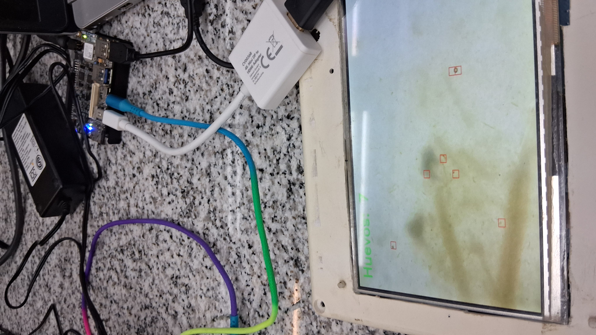
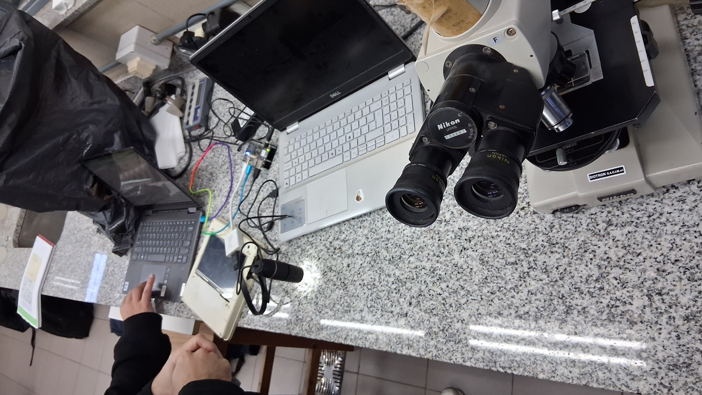

# Parasite Egg Counter — FPGA Edge AI System

> Portable embedded system for automated parasitological diagnosis in ruminants using deep learning inference on FPGA.

## Overview

This system automates the [McMaster technique](https://en.wikipedia.org/wiki/McMaster_technique) for parasite egg counting in livestock fecal samples. A USB digital microscope captures images that are processed in real-time by a convolutional neural network accelerator running on an FPGA. Results are displayed on a mobile phone via a self-hosted WiFi access point — no internet connection required.

**Inference time: 0.505 seconds per full image (1,344 patches of 15×15 pixels)**

## System Architecture

The system runs entirely on an [Avnet Ultra96-V2](https://www.avnet.com/wps/portal/us/products/avnet-boards/avnet-board-families/ultra96-v2/) (Xilinx Zynq UltraScale+ MPSoC):

- **PL (Programmable Logic):** DPU B1600 accelerator synthesized via Vitis AI 2.5
- **PS (Processing System):** ARM Cortex-A53 running Ubuntu + PYNQ 3.0.1
- **Inference pipeline:** USB microscope → OpenCV capture → INT8 patch inference on DPU → sigmoid post-processing on CPU → Flask web server
- **Connectivity:** Self-hosted WiFi access point (hostapd + dnsmasq) at 192.168.4.1

## Technical Highlights

- **Vitis AI 2.5 migration:** Migrated quantization and compilation pipeline from Vitis AI 1.4 to 2.5. The new runtime removed automatic float32→INT8 conversion, requiring explicit INT8 buffer management and manual fixed-point scaling to eliminate segmentation faults during `execute_async`.
- **Fixed-point quantization:** Input/output tensors use INT8 with fix_point scaling (`2^fix_point` for input, `2^-fix_point` for output). Sigmoid activation is computed on the CPU host as the DPU B1600 does not support floating-point activation functions natively.
- **Patch-based inference:** Each 640×480 frame is divided into 1,344 non-overlapping 15×15 patches. Each patch is classified independently as egg/no-egg with a confidence threshold of 0.74.
- **Autonomous boot:** A custom systemd service with a deliberate 40-second pre-start delay ensures the WiFi interface is fully initialized before hostapd is launched, preventing interface conflicts on cold boot.
- **Zero-dependency field operation:** The device operates as a standalone WiFi access point. No router, no internet, no laptop required. Any smartphone can connect and view results.

## Repository Structure

    parasite-counter-fpga/
    ├── inference/
    │   └── inference.py       # DPU inference pipeline (patch extraction, INT8 buffers, sigmoid)
    ├── server/
    │   └── app.py             # Flask web server + WiFi access point initialization
    ├── deploy/
    │   └── parasite.service   # systemd unit for autonomous boot
    └── docs/
        ├── demo_flask.png     # Mobile UI showing detection results
        ├── display_result.jpg # DisplayPort output (earlier version)
        ├── hardware.jpg       # Ultra96-V2 hardware setup
        └── lab_civetan.jpg    # Field validation at CIVETAN lab

## Hardware Requirements

| Component | Details |
|-----------|---------|
| FPGA Board | Avnet Ultra96-V2 (Zynq UltraScale+ MPSoC) |
| DPU | B1600 (batch 1) |
| Framework | PYNQ 3.0.1 + Vitis AI 2.5 |
| Microscope | USB digital microscope (OpenCV-compatible) |
| Model | small_gray_classifierU96_b1600.xmodel |

## Lab Validation

Field validation was performed at [CIVETAN](https://civetan.wordpress.com/) (Centro de Investigación Veterinaria de Tandil) using real fecal samples from ruminants. The system successfully detected parasite eggs in under one second per capture, compared to the traditional manual method which takes 15+ minutes per sample.

## Authors

Developed by **Lucas Rotolo** and **María Victoria Dibar** as part of the Final Engineering Project (*Proyecto Final de Carrera*) at UNICEN — Facultad de Ciencias Exactas, Tandil, Argentina (2026).

Hardware deployment and inference pipeline: Lucas Rotolo  
Director: Mg. Lucas Leiva | Co-director: Dr. Martín Vázquez
